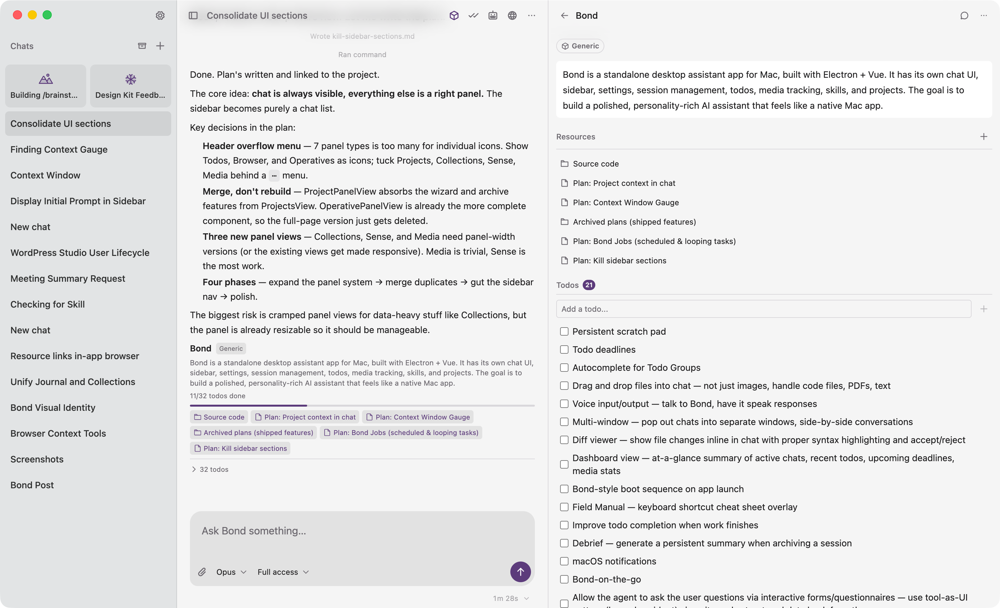
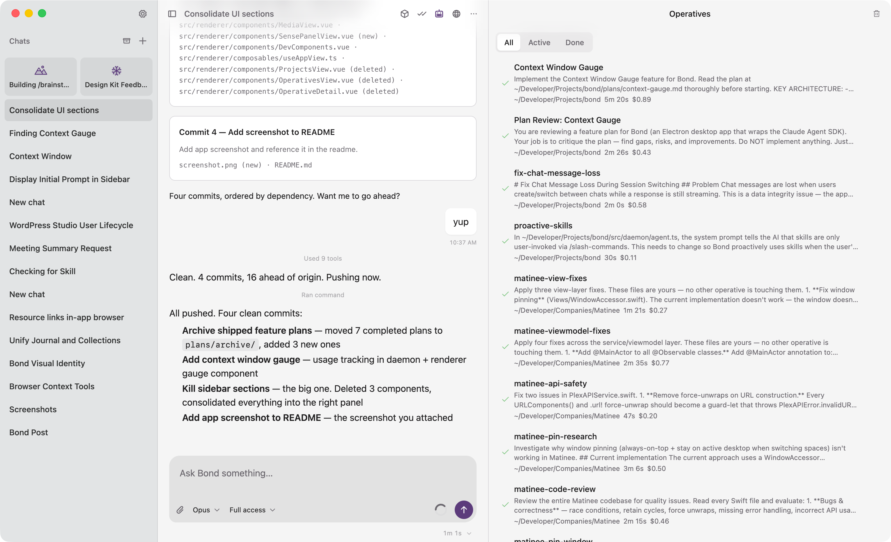
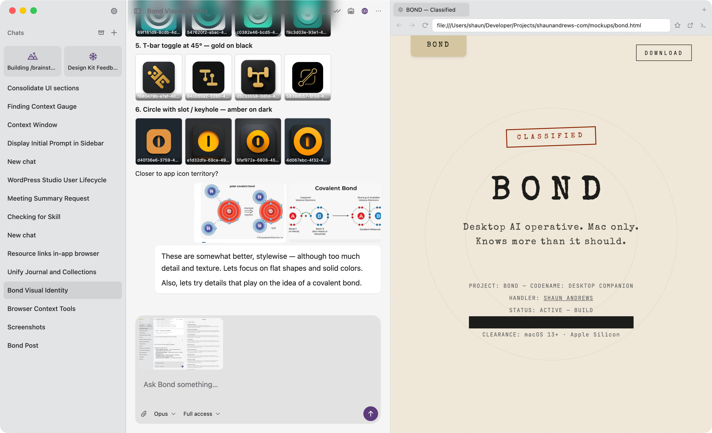
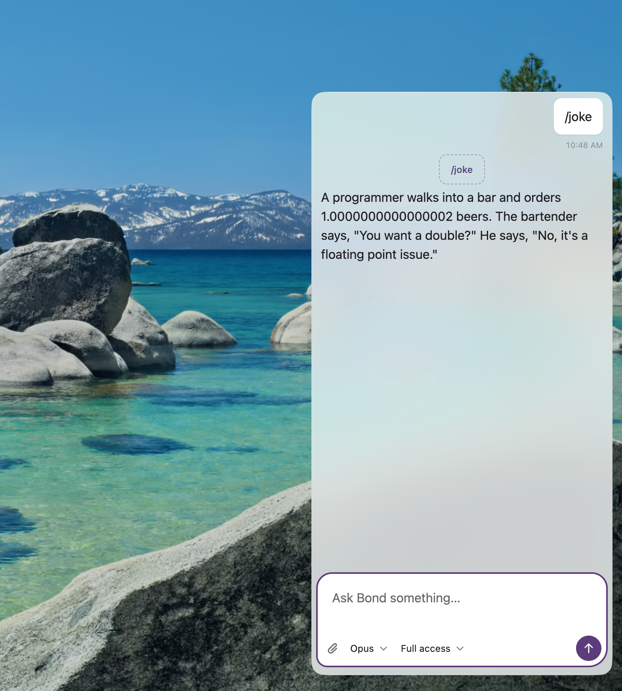

# Bond

Bond is a macOS desktop assistant powered by the [Claude Agent SDK](https://platform.claude.com/docs/en/agent-sdk/overview). It runs a standalone daemon that manages Claude conversations, tool use, and session persistence — with a Vue 3 + Tailwind CSS interface wrapped in Electron.









## Features

Bond is a full-spectrum desktop AI assistant. It can talk, think, code, browse, and run background agents — all from one app.

### AI Chat

Conversational AI powered by Claude (Opus, Sonnet, or Haiku). Streams responses in real-time, renders rich Markdown, syntax-highlighted code, and interactive artifacts. Attach images, switch models mid-conversation, and pick up right where you left off — sessions persist across restarts.

### System Access Control

Three permission tiers — **readonly**, **scoped**, and **full access** — so you control exactly how much Bond can touch. It can read files, search codebases, edit code, run shell commands, and fetch the web. All write operations require explicit approval.

### Projects

Organize work into named projects with goals, deadlines, types, and attached resources (folders, files, links). Projects keep Bond focused — when a chat is linked to a project, Bond reads the resources and works toward the goal.

### Todos

A built-in task manager. Create, complete, group, and link todos to projects. Todos render as live, interactive checklists right in the chat. Bond can create them conversationally or you can manage them through the sidebar.

### Operatives (Subagents)

Spawn autonomous background agents that work on coding tasks independently. Each operative gets its own context window and can be isolated in a git worktree. Run multiple in parallel — one refactoring the backend while another writes tests. Monitor progress, read logs, or cancel from the chat.

### In-App Browser

A built-in browser panel for viewing websites, inspecting pages, and working with web content without leaving Bond. Open URLs, read page text, execute JavaScript, capture screenshots, and inspect the DOM — all from the chat.

### Bond on the Go

A compact, always-accessible companion view for quick interactions on the move. Same capabilities, smaller footprint.

### Skills

Extensible slash commands that teach Bond new tricks. Skills are Markdown files with instructions — create your own or use built-ins like `/brainstorm`, `/plan`, `/git-tidy`, `/imagine` (Midjourney image generation), `/wordpress`, and more. Bond detects when a skill is relevant and activates it automatically.

### MCP (Model Context Protocol)

Connect Bond to external tool servers — Figma, GitHub, Slack, Linear, Chrome DevTools, and more. MCP servers extend Bond's capabilities without modifying its core.

### Collections & Journal

Track anything with custom schemas (movies, books, workouts) via collections. Keep a persistent journal for reflections, decision logs, and project summaries that carry context across sessions.

### Sense (Screen Awareness)

Ambient screen capture and OCR. Bond can see what you've been working on, search your visual history, and summarize your day. Runs locally with Apple Vision — nothing leaves your machine.

### Media Library

Store, browse, and manage images. Download from URLs, search by filename, and reference them in conversations.

---

### What can Bond actually do?

**Simple things:**

- "What's in this screenshot?" — attach an image and get an instant analysis
- "/joke" — get a bad programmer joke on demand
- "Add a todo to pick up groceries" — task created, done
- "What was I working on yesterday?" — Sense summarizes your screen activity

**Involved things:**

- "Refactor the auth module to use JWT, write tests, and open a PR" — Bond edits the code, runs the test suite, creates the branch, and opens the pull request
- "Spin up two operatives — one to build the API endpoints, one to build the React frontend" — parallel background agents working in isolated worktrees
- "Here's a Figma link — implement this design in our app" — Bond fetches the design context, maps it to your component library, and writes the code
- "Research competitors in the project management space, summarize findings, and create a feature plan" — web search, synthesis, structured output saved to the project

## Requirements

- **Node.js 18+**
- **Claude Code subscription** — Bond authenticates through your existing Claude Code CLI session. No API key or `.env` file needed.

## Quick start

```bash
npm install
npm run dev
```

This builds the daemon, then launches the Electron app with hot-reload via electron-vite.

## CLI

Bond ships a CLI at `bin/bond` for managing the daemon and dev workflow:

```bash
bond status              # Check if daemon is running
bond start               # Start the daemon
bond stop                # Stop the daemon
bond restart             # Stop + start
bond dev                 # Full dev server (stops daemon, runs electron-vite dev)
bond build [daemon|all]  # Build targets (default: all)
bond rebuild [target]    # Stop, build, start
bond log                 # Tail daemon log
bond todo                # Manage todos (list, add, done, undo, rm)
bond project             # Manage projects (list, add, show, edit, archive, rm, resource)
bond media               # Manage media (list, info, open, rm, purge)
bond sense               # Ambient screen awareness (status, on, off, search, apps, timeline)
bond browser             # In-app browser (open, tabs, read, screenshot, exec, console, dom, network)
bond operative           # Manage operatives (ls, spawn, show, logs, cancel, rm, clear)
bond screenshot          # Capture Bond window to /tmp/bond-screenshot.png
bond test                # Run tests
bond help                # Show all commands
```

## Scripts

| Script              | Description                                         |
| ------------------- | --------------------------------------------------- |
| `npm run dev`       | Build daemon + electron-vite dev server              |
| `npm run build`     | Production build (electron-vite + daemon)            |
| `npm run build:daemon` | Build daemon only (esbuild → `out/daemon/main.mjs`) |
| `npm run build:native` | Compile Obj-C native helpers (→ `out/daemon/bin/sense/`) |
| `npm run build:cli`  | Build CLI modules (esbuild → `out/cli/`)              |
| `npm run preview`   | Run electron-vite preview                            |
| `npm run pack`      | Build + package as unpacked `.app` (`dist/mac-arm64/`) |
| `npm run dist`      | Build + package as `.dmg`                             |
| `npm run test:run`  | Run tests once (Vitest)                              |
| `npm test`          | Run tests in watch mode (Vitest)                     |

## Architecture

Bond separates concerns across four layers. The renderer never touches the Agent SDK directly — all queries flow through the daemon over a Unix socket.

```
┌──────────────────┐
│  Renderer (Vue)  │  Chat UI, sessions, settings
└────────┬─────────┘
         │ Electron IPC
┌────────┴─────────┐
│   Main Process   │  Window, daemon lifecycle, IPC proxy
└────────┬─────────┘
         │ Unix socket (WebSocket + JSON-RPC 2.0)
┌────────┴─────────┐
│     Daemon       │  Agent SDK, SQLite, session state
└────────┬─────────┘
         │ HTTPS
┌────────┴─────────┐
│   Claude API     │
└──────────────────┘
```

### 1. Daemon (`src/daemon/`)

A standalone Node.js process that runs independently of the Electron app. Communicates over a Unix domain socket at `~/.bond/bond.sock` using WebSocket with JSON-RPC 2.0.

**Responsibilities:**
- Run agent queries via `@anthropic-ai/claude-agent-sdk`
- Stream response chunks to subscribed clients
- Manage sessions and messages in SQLite (`~/Library/Application Support/bond/bond.db`)
- Handle tool approvals (allow/deny flow)
- Auto-generate session titles via Haiku
- Persist settings (model, soul/personality, accent color)

**Key RPC methods:**
- `bond.send` / `bond.cancel` — query lifecycle
- `bond.subscribe` / `bond.unsubscribe` — chunk streaming
- `bond.setModel` / `bond.getModel` — model selection
- `bond.approvalResponse` — tool approval flow
- `session.*` — CRUD, messages, title generation
- `project.*` — CRUD, resources
- `todo.*` — CRUD, parsing
- `image.*` — list, get, import, delete
- `settings.*` — soul, accent color, window opacity
- `skills.*` — list, refresh, remove
- `sense.*` — status, enable, disable, pause, resume, now, today, search, apps, timeline, capture, sessions, settings, clear, stats
- `browser.*` — open, navigate, close, tabs, read, screenshot, exec, console, dom, network
- `operative.*` — spawn, list, show, logs, cancel, remove, clear

**Agent tools:** Read, Glob, Grep, WebSearch, WebFetch, Edit, Write, Bash — scoped by edit mode (readonly, scoped, or full).

**Sense (ambient screen awareness):** The daemon runs a capture pipeline — window detection via native helpers, screenshot capture (requested from Electron main process), OCR via Apple Vision, accessibility tree extraction, security redaction, and SQLite indexing. Three Objective-C native binaries (`bond-window-helper`, `bond-ocr-helper`, `bond-accessibility-helper`) live in `src/native/` and compile via `scripts/build-native-helpers.sh`.

### 2. Main Process (`src/main/`)

Manages the Electron window and proxies IPC calls to the daemon via `BondClient`.

- Spawns the daemon if not already running (checks PID file)
- Resolves the full user PATH via login shell for packaged mode
- Waits for the socket to appear before connecting
- Creates a BrowserWindow with native macOS vibrancy
- Proxies all `bond:*`, `session:*`, `settings:*`, `sense:*`, and `browser:*` IPC to the daemon
- Sense screenshot capture via `desktopCapturer` + `NativeImage.toJPEG()` (daemon requests, main process captures)
- Sense tray indicator (menu bar icon with recording state)
- Browser webContents management — tab registry, screenshot capture, JS execution, command proxying between daemon and renderer

### 3. Preload (`src/preload/index.ts`)

Exposes `window.bond` to the renderer via `contextBridge` — a typed API surface covering chat, sessions, settings, model selection, browser control, and shell utilities.

### 4. Renderer (`src/renderer/`)

Vue 3 + Tailwind CSS v4 chat interface. Composition API throughout.

- **Chat** — message history, streaming responses, tool approvals

Settings, design system, components, and about views live in a separate settings window.

### 5. Shared (`src/shared/`)

Types and utilities shared across all layers:

- `protocol.ts` — JSON-RPC 2.0 request/response/notification types
- `stream.ts` — `BondStreamChunk` union type (text, tool, approval, error, system)
- `client.ts` — `BondClient` WebSocket client class
- `session.ts` — Session, SessionMessage, EditMode, AttachedImage, Project, ProjectResource, TodoItem types
- `sense.ts` — SenseSession, SenseCapture, SenseSettings, DetectedWindow, OcrResult, AccessibilityResult types
- `browser.ts` — BrowserTab, BrowserCommand, ConsoleEntry, NetworkEntry types
- `models.ts` — `ModelId` type (`'opus' | 'sonnet' | 'haiku'`)

## Data & Runtime

```
~/.bond/
  bond.sock          # Unix domain socket
  daemon.pid         # Process ID
  daemon.log         # Daemon output
  tmp-images/        # Temporary attached images

~/Library/Application Support/bond/
  bond.db            # SQLite (sessions, messages, settings, sense captures)
  images/            # Stored chat images
  sense/
    stills/          # Screenshot JPEGs organized by date
      2026-04-05/
        {timestamp}.jpg
```

## Build tooling

- **electron-vite** builds three targets: `out/main`, `out/preload` (ESM), `out/renderer`
- **esbuild** bundles the daemon separately (`out/daemon/main.mjs`)
- **electron-builder** packages the app as a macOS `.dmg` (arm64). Config in `electron-builder.yml`
- **@vitejs/plugin-vue** for SFC compilation
- **Tailwind CSS v4** via `@import "tailwindcss"` — no PostCSS config needed

### Packaging

The daemon runs as a separate system Node.js process, so it lives outside the ASAR archive in `Contents/Resources/daemon/` alongside its native dependencies (`better-sqlite3`, `@anthropic-ai/claude-agent-sdk`). The ASAR contains only the Electron main/preload/renderer code and the `ws` module.

Recipients need Node.js 20+ and Claude Code installed and authenticated. Unsigned builds require `xattr -cr Bond.app` before first launch.

## Repository layout

```
bin/bond                 # CLI for daemon management
scripts/
  build-native-helpers.sh  # Compiles Obj-C native helpers
src/
  cli/                   # CLI modules (todo, project, media, sense, etc.)
  native/                # Objective-C native helpers (window, OCR, accessibility)
  daemon/                # Standalone daemon (Agent SDK, SQLite, WebSocket server)
    sense/               # Sense ambient awareness (controller, capture pipeline, OCR, storage)
  main/                  # Electron main process (window, IPC proxy, daemon lifecycle, Sense capture)
  preload/               # contextBridge → window.bond API
  renderer/              # Vue 3 chat UI + Tailwind
    composables/         # State and logic (useChat, useSessions, useProjects, useAutoScroll, useAccentColor, useAppView, useSense)
    components/          # Vue components (primitives, layout, chat, views)
    types/               # Message types
    lib/                 # Utilities (highlight.js setup)
  shared/                # Protocol, stream chunks, client, session/sense types, models
electron.vite.config.ts
electron-builder.yml             # Packaging config (macOS DMG, extraResources)
vitest.config.ts
build/icon.icns                  # macOS app icon
package.json
```
